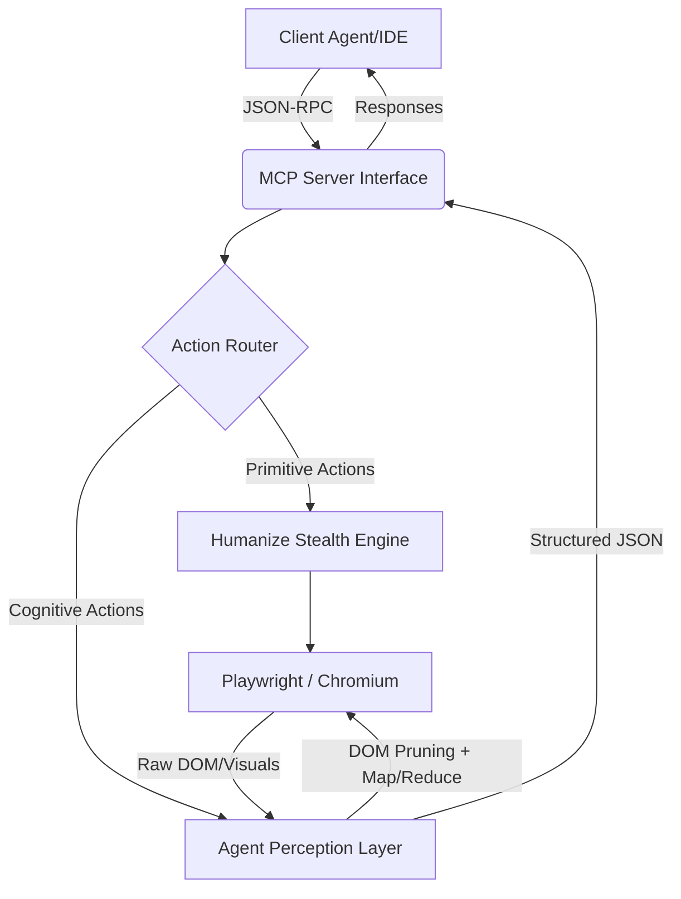

# Go-WebMCP: Unified Architecture & System Design

This document serves as the definitive architecture reference for the Go-WebMCP project, unifying all individual functionalities (Agentic Perception, Stealth Browser Engine, and MCP Server) into a single cohesive system map.

## 1. High-Level Architecture Overview

The system is designed as a strict pipeline flowing from the **Client Agent** (via MCP) down to the **Headless Browser** (via Playwright), intercepting and processing data with an intelligent **Cognitive LLM Layer**.

## 2. Core Modules & Functionalities

### A. The MCP Server Layer (`cmd/server/main.go`)
This is the entry point of the application. It establishes standard communication natively with any IDE (Cursor, Claude) or programmatic Python orchestrator.
- **Transports:** Supports both Unix `stdio` pipes (for local IDE pairing) and `HTTP/SSE` mode (for decoupled remote container orchestration).
- **Tool Registration:** Exposes atomic tools (`browse`, `click`, `type`, `scroll`, `scroll_to_bottom`, `fill_form`, `configure_dialog`) and abstract tools (`extract`).

### B. The Stealth Browser Engine (`pkg/browser/`)
This is the heart of the web interaction. Instead of raw programmatic clicks, it "humanizes" all automation to evade WAFs (Web Application Firewalls) like Cloudflare Turnstile and DataDome.
- **`engine.go`:** Manages the Playwright Context. Tracks active tabs, captures console logs, intercepts network requests, and auto-bypasses blocking JavaScript `alert()` dialogs.
- **`stealth.go`:** Strips automation metrics from the browser fingerprint. Injects custom scripts to mask `navigator.webdriver`, spoofs WebRTC, and normalizes viewport behavior.
- **`humanize.go`:** Implements physical input obfuscation. 
    - *Mouse Paths:* Uses Quadratic Bézier curve generation (`BezierMouseMove`) with small pixel-level jitter to simulate natural human hesitation.
    - *Typing:* Injects variable delays (50-150ms) between keystrokes to mimic a human WPM cadence.
    - *Adaptive Scrolling:* Checks `document.documentElement.scrollHeight` iteratively until the DOM physically stops mutating, perfectly hydrating massive infinite-scroll feeds (Twitter, LinkedIn).

### C. The Agentic Perception Layer (`pkg/agent/`)
This layer handles the complex orchestration of converting raw, dirty HTML into structured, schema-validated JSON. It utilizes Heterogeneous Model Routing to balance intelligence with cost and speed.
- **WebMCP Ecosystem Bridge:** Intercepts page visits to actively scan for `navigator.modelContext`. If W3C native MCP functions exist on the target website, the engine warns the LLM to prioritize native hooks over DOM scraping natively.
- **Aggressive DOM Pruning:** Uses a custom JavaScript injection string to physically shred non-important HTML tags (`<nav>`, `<footer>`, `<svg>`, `<script>`) from the DOM tree, heavily compressing 1MB codebases down to manageable strings.
- **Format Translation:** Converts the simplified HTML into dense Markdown, further packing information tightly for the LLM Context window.

#### Advanced Feature: Map-Reduce Chunking Extraction (`perception.go`)
When faced with massive Single Page Application (SPA) strings (e.g., 300,000 chars of Naukri job boards), the agent does not send the whole blob at once (preventing Rate Limits and Context Truncation).
1. **Intelligent Boundary Detection (Map):** Small LLM call attempts to identify repeating visual markers in the Markdown (`---`, `##`) to split the document perfectly on physical object boundaries.
2. **Fallback Chunking:** If LLM fails, Go falls back to violently slicing the document on Double Newlines (`\n\n`) up to ~2,000 characters.
3. **Parallel Execution:** A strict 5-worker Go Semaphore pool (`chan struct{}`) unleashes parallel chunks to the ultra-fast LLM API (e.g., NVIDIA NIM / Llama-3.1-8b).
4. **Stitching & Repair (Reduce):** Results stream back into Go. Failed or syntactically incorrect JSON strings are passed through a `jsonrepair` auto-healing parser, unmarshaled from isolated strings back into pure Go `interface{}` slices, and merged into a continuous, singular valid JSON block returned to the MCP client.

## 3. Deployment & Operational Modalities
- **Containerized Headless Execution:** With the provided `Dockerfile`, the entire system (Go binary + Chromium binaries) compiles into an isolated execution node exposing Port 8080. It can be horizontally scaled for massive data farming jobs without state collision.
- **Local Dev Mode:** Binds via `stdio` using `.mcp.json` IDE configurations directly into the developer's workstation for on-the-fly code research and web orchestration.
