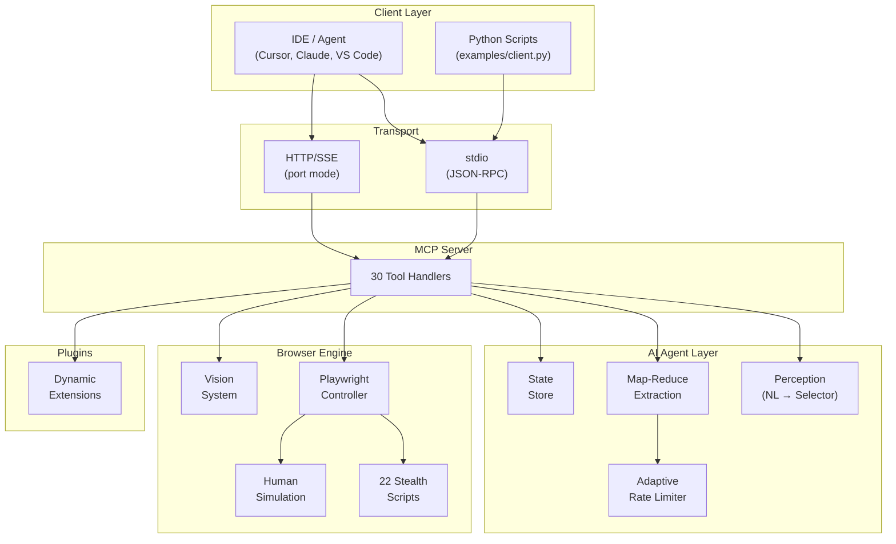

<p align="center">
  <h1 align="center">🌐 Go-WebMCP</h1>
  <p align="center">
    <strong>Intelligent Stealth Browser &bull; MCP Server &bull; Built for AI Agents</strong>
  </p>
  <p align="center">
    <a href="https://github.com/yranjan06/GO-WebMcp/blob/main/LICENSE"></a>
    <a href="https://go.dev"></a>
    <a href="https://github.com/yranjan06/GO-WebMcp/blob/main/CONTRIBUTING.md"></a>
    <a href="https://github.com/yranjan06/GO-WebMcp/issues"></a>
    <a href="https://github.com/yranjan06/GO-WebMcp/stargazers"></a>
  </p>
  <p align="center">
    <a href="#-quick-start">Quick Start</a> •
    <a href="#-features">Features</a> •
    <a href="#-available-tools-30">Tools</a> •
    <a href="#-architecture">Architecture</a> •
    <a href="#-examples">Examples</a> •
    <a href="CONTRIBUTING.md">Contributing</a>
  </p>
</p>

---

Go-WebMCP is a production-ready **Model Context Protocol (MCP)** server built in Go. It acts as an **Intelligent Stealth Browser** — enabling LLMs, autonomous agents, and AI-powered IDEs to navigate the web, bypass anti-bot systems, and extract structured data at scale.

> **30 MCP tools** · **22 stealth scripts** · **Zero-config IDE integration** · **Plugin system** · **Works with any LLM**

Built with ❤️ for the AI community. **Contributions welcome!**

## ✨ Features

| Feature | Description |
|---|---|
| 🧠 **LLM-Powered Navigation** | Navigate using natural language — `click("Login button")`, `type("Search box", "AI tools")` |
| 🥷 **Stealth Hardening** | 22 Playwright-level fingerprint patches: Bézier mouse, human typing, WebGL/Canvas noise, font spoofing |
| 📊 **Map-Reduce Extraction** | Splits massive pages (300K+ chars) → smart chunks → parallel LLM extraction → validated JSON |
| 🔍 **Page Context Analysis** | Zero-LLM page analyzer: detects page type, features, interactive elements — helps agents plan smartly |
| 👁️ **Vision System** | Labeled screenshots with bounding boxes for Vision-Language Models |
| 🔌 **Plugin System** | Drop JSON+JS into `extensions/` — auto-registered as MCP tools at startup |
| 💾 **Memory Store** | Key-value storage between tool calls for multi-step workflows |
| ⚡ **Parallel Extraction** | Extract data from multiple URLs simultaneously with isolated browser contexts |
| 🔄 **Adaptive Rate Limiting** | Dynamic concurrency control — auto-reduces on 429, recovers after success |
| 🌐 **Universal LLM Support** | OpenAI, Ollama, Groq, Together, NVIDIA NIM, LM Studio — any OpenAI-compatible API |
| 🐳 **Docker Ready** | Single-command containerized deployment for headless scraping at scale |

## 🚀 Quick Start

### Prerequisites

- **Go 1.26+** ([install](https://go.dev/dl/))
- **Playwright browsers**: installed automatically via `make install-deps`

### Option 1: Local Binary (IDE Integration)

```bash
# Clone and build
git clone https://github.com/yranjan06/GO-WebMcp.git
cd GO-WebMcp
make install-deps
make build
```

**Add to your IDE's MCP config** (`mcp.json` or `settings.json`):

```json
{
  "mcpServers": {
    "go-webmcp": {
      "command": "/absolute/path/to/webmcp",
      "env": {
        "AI_API_KEY": "your-api-key",
        "AI_MODEL": "gpt-4o"
      }
    }
  }
}
```

### Option 2: Docker

```bash
make docker
docker run -p 8080:8080 \
  -e AI_API_KEY="your-key" \
  -e BROWSER_HEADLESS="true" \
  go-webmcp --port=8080
```

### Option 3: Docker Compose

```bash
export AI_API_KEY="your-key"
make docker-compose
```

## ⚙️ Environment Variables

| Variable | Required | Default | Description |
|---|---|---|---|
| `AI_API_KEY` | Yes | — | API key for your LLM provider |
| `AI_BASE_URL` | — | OpenAI | Custom LLM endpoint URL |
| `AI_MODEL` | — | `gpt-4o` | Model for element finding + extraction |
| `EXTRACTION_MODEL` | — | same as `AI_MODEL` | Separate (faster) model for data extraction |
| `EXTRACTION_API_KEY` | — | same as `AI_API_KEY` | Separate key for extraction model |
| `EXTRACTION_BASE_URL` | — | same as `AI_BASE_URL` | Separate endpoint for extraction |
| `BROWSER_HEADLESS` | — | `false` | Run Chromium in headless mode |
| `BROWSER_USER_DATA_DIR` | — | — | Persist cookies/sessions across restarts |
| `HTTP_PROXY` | — | — | Proxy server (e.g., `http://proxy:8080`) |
| `PROXY_USERNAME` | — | — | Proxy authentication username |
| `PROXY_PASSWORD` | — | — | Proxy authentication password |

**Multi-LLM Examples:**
```bash
# Groq (free tier)
export AI_API_KEY="gsk_..." AI_BASE_URL="https://api.groq.com/openai/v1" AI_MODEL="llama-3.1-8b-instant"

# Ollama (local)
export AI_API_KEY="ollama" AI_BASE_URL="http://localhost:11434/v1" AI_MODEL="llama3.1"

# NVIDIA NIM
export AI_API_KEY="nvapi-..." AI_BASE_URL="https://integrate.api.nvidia.com/v1" AI_MODEL="meta/llama-3.1-8b-instruct"
```

## 🛠️ Available Tools (30)

### Navigation
| Tool | Description |
|---|---|
| `browse` | Navigate to a URL with full stealth mode |
| `go_back` | Browser back button |
| `go_forward` | Browser forward button |

### AI Interaction
| Tool | Description |
|---|---|
| `click` | Natural-language driven smart clicking (LLM finds element) |
| `type` | Humanized typing on a targeted element |
| `press_key` | Simulate keyboard key press (Enter, Tab, Escape, etc.) |
| `fill_form` | Batch fill multiple form fields with human-like delays |
| `scroll` | Scroll up/down with human-like behavior |
| `scroll_to_bottom` | Dynamically scroll infinite feeds to completion |

### Data Extraction
| Tool | Description |
|---|---|
| `extract` | Map-Reduce JSON extraction — provide schema, get structured data |
| `parallel_extract` | Extract from multiple URLs simultaneously (isolated contexts) |
| `execute_js` | Run arbitrary JavaScript in the page context |
| `get_accessibility_tree` | Get semantic ARIA snapshot of the page |
| `get_page_context` | **Zero-LLM page analyzer** — detects page type, features, counts |

### Vision
| Tool | Description |
|---|---|
| `screenshot` | Capture viewport as base64 PNG |
| `capture_labeled_snapshot` | Labeled screenshot with bounding boxes for VLMs |

### Memory
| Tool | Description |
|---|---|
| `memorize_data` | Store key-value data (JSON/strings) between tool calls |
| `recall_data` | Retrieve stored data by key |
| `list_memory_keys` | List all stored keys |

### Multi-Tab
| Tool | Description |
|---|---|
| `open_tab` | Open a new browser tab |
| `switch_tab` | Switch to a tab by index |
| `close_tab` | Close a tab by index |
| `list_tabs` | List all open tabs with URLs and titles |

### Utilities
| Tool | Description |
|---|---|
| `wait_for_selector` | Wait for a CSS selector to appear |
| `wait_for_load_state` | Wait for page load / network idle |
| `configure_dialog` | Auto-handle browser alert/confirm/prompt dialogs |
| `get_status` | Server health + last action report |
| `get_console_logs` | Retrieve browser console output |
| `get_network_requests` | Get captured HTTP request log |
| `clear_network_requests` | Clear the request log |

## 🏗️ Architecture



## 📦 Project Structure

```
GO-WebMcp/
├── cmd/server/              # MCP server entry point
│   ├── main.go              # Bootstrap: flags, banner, transport
│   ├── tools.go             # 30 MCP tool handlers
│   └── config.go            # Version and constants
├── pkg/
│   ├── agent/               # AI-powered intelligence
│   │   ├── perception.go    # NL element finding via accessibility tree
│   │   ├── extract.go       # 5-stage Map-Reduce extraction pipeline
│   │   ├── ratelimit.go     # Adaptive rate limiter (429-aware)
│   │   ├── memory.go        # Thread-safe key-value StateStore
│   │   └── subtask.go       # Parallel multi-URL extraction
│   ├── browser/             # Playwright engine wrapper
│   │   ├── engine.go        # Core: init, navigate, tabs, scroll, page context
│   │   ├── humanize.go      # Bézier mouse, typing delays, natural scrolling
│   │   ├── vision.go        # Labeled screenshots with bounding boxes
│   │   └── retry.go         # Exponential backoff utility
│   ├── stealth/             # Anti-detection layer
│   │   ├── stealth.go       # Config + script injection
│   │   └── js/ (22 files)   # Embedded fingerprint patches
│   ├── plugins/             # Dynamic plugin system
│   │   └── runtime.go       # JSON+JS plugin loader
│   └── transport/sse/       # HTTP/SSE transport
├── examples/                # Ready-to-run demo scripts
│   ├── client.py            # Reusable MCP Python client
│   ├── e2e_amazon_flipkart.py  # Smart price+review comparison
│   ├── test_page_context.py    # 10-site page detection test
│   └── ...                  # LinkedIn, Reddit, Twitter, etc.
├── extensions/              # Drop-in plugin directory
├── Dockerfile
├── docker-compose.yml
├── Makefile
└── go.mod
```

## 🐍 Python Integration

Use the built-in client from `examples/client.py`:

```python
from examples.client import GoWebMCPClient

client = GoWebMCPClient()

# Navigate
client.call("browse", {"url": "https://news.ycombinator.com"})

# Analyze page
context = client.call("get_page_context", {})
print(context)  # {"page_type": "listing_page", "link_count": 229, ...}

# Extract structured data
data = client.call("extract", {
    "schema": {
        "type": "array",
        "items": {
            "type": "object",
            "properties": {
                "title": {"type": "string"},
                "points": {"type": "string"},
                "comments": {"type": "string"}
            }
        },
        "description": "Top 10 stories with title, points, comments"
    }
})

client.close()
```

## 🔌 Plugin System

Extend Go-WebMCP without modifying core code. Drop files into `extensions/`:

**1. Create `extensions/my_scraper.json`:**
```json
{
  "name": "my_scraper",
  "description": "Extract custom data from current page",
  "script_file": "my_scraper.js"
}
```

**2. Create `extensions/my_scraper.js`:**
```javascript
(args) => {
    const items = document.querySelectorAll('.item');
    return JSON.stringify(
        Array.from(items).map(el => ({
            text: el.textContent.trim(),
            href: el.querySelector('a')?.href
        }))
    );
}
```

**3. Restart server** — `my_scraper` is now available as an MCP tool!

## 📁 Examples

| Script | What It Does |
|---|---|
| [`client.py`](examples/client.py) | Reusable MCP Python client (shared by all scripts) |
| [`e2e_amazon_flipkart.py`](examples/e2e_amazon_flipkart.py) | Smart multi-step: navigate → extract → click product → isolate reviews → compare |
| [`test_page_context.py`](examples/test_page_context.py) | Tests page detection on 10 major websites (no API key needed) |
| [`e2e_demo.py`](examples/e2e_demo.py) | Basic navigation + extraction demo |
| [`e2e_linkedin.py`](examples/e2e_linkedin.py) | LinkedIn profile extraction |
| [`e2e_reddit.py`](examples/e2e_reddit.py) | Reddit subreddit scraping |
| [`e2e_twitter.py`](examples/e2e_twitter.py) | Twitter/X feed extraction |
| [`e2e_naukri.py`](examples/e2e_naukri.py) | Job portal extraction |
| [`test_tools.py`](examples/test_tools.py) | Tool integration tests |

## 🤝 Contributing

We welcome contributions of all sizes! See [CONTRIBUTING.md](CONTRIBUTING.md) for detailed guides.

**Quick ways to contribute:**
- 🐛 **Report bugs** — [Open an issue](https://github.com/yranjan06/GO-WebMcp/issues)
- 💡 **Suggest features** — Ideas for new tools or improvements
- 🥷 **Add stealth scripts** — New browser fingerprint bypasses
- 🔌 **Create plugins** — Share useful extensions
- 🛠️ **Add MCP tools** — Expand the tool suite
- 📝 **Improve docs** — Fix typos, add examples, clarify explanations
- 🧪 **Write tests** — Improve test coverage

## 📄 License

MIT License — see [LICENSE](LICENSE) for details.

## ⭐ Star History

If you find Go-WebMCP useful, please give it a ⭐ — it helps the project grow!

---

<p align="center">
  Built with ❤️ for the AI community<br/>
  <a href="https://github.com/yranjan06/GO-WebMcp">GitHub</a> •
  <a href="https://github.com/yranjan06/GO-WebMcp/issues">Issues</a> •
  <a href="CONTRIBUTING.md">Contribute</a>
</p>
