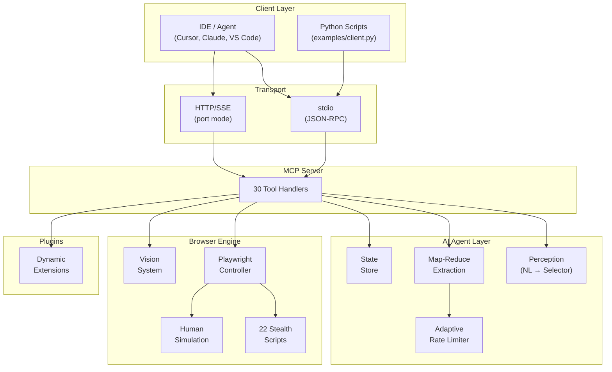

<p align="center">
  <h1 align="center">Go-WebMCP</h1>
  <p align="center">
    <strong>Intelligent Stealth Browser &bull; MCP Server &bull; Built for AI Agents</strong>
  </p>
  <p align="center">
    <a href="https://github.com/yranjan06/GO-WebMcp/blob/main/LICENSE"></a>
    <a href="https://go.dev"></a>
    <a href="https://github.com/yranjan06/GO-WebMcp/blob/main/CONTRIBUTING.md"></a>
    <a href="https://github.com/yranjan06/GO-WebMcp/issues"></a>
    <a href="https://github.com/yranjan06/GO-WebMcp/stargazers"></a>
  </p>
  <p align="center">
    <a href="#quick-start">Quick Start</a> •
    <a href="#available-tools-30">Tools</a> •
    <a href="#how-it-works">How It Works</a> •
    <a href="CONTRIBUTING.md">Contributing</a>
  </p>
</p>

---

**The stealthiest, most reliable MCP browser server for AI agents.** 30 tools. 22 anti-fingerprint scripts. LLM-powered extraction. Zero IDE setup hassle.

Go-WebMCP is a production-ready **Model Context Protocol (MCP)** server built in Go. It acts as an **Intelligent Stealth Browser** — enabling LLMs, autonomous agents, and AI-powered IDEs to navigate the web, bypass anti-bot systems, and extract structured data at scale.

> **30 MCP tools** · **22 stealth scripts** · **Zero-config IDE integration** · **Plugin system** · **Works with any LLM**

Built with ❤️ for the AI community. **[Contributions welcome!](CONTRIBUTING.md)**

## Features

| Feature | Description |
|---|---|
| **LLM-Powered Navigation** | Navigate using natural language — `click("Login button")`, `type("Search box", "AI tools")` |
| **Stealth Hardening** | 22 Playwright-level fingerprint patches: Bézier mouse, human typing, WebGL/Canvas noise, font spoofing |
| **Map-Reduce Extraction** | Splits massive pages (300K+ chars) → smart chunks → parallel LLM extraction → validated JSON |
| **Page Context Analysis** | Zero-LLM page analyzer: detects page type, features, interactive elements — helps agents plan smartly |
| **Vision System** | Labeled screenshots with bounding boxes for Vision-Language Models |
| **Plugin System** | Drop JSON+JS into `extensions/` — auto-registered as MCP tools at startup |
| **Memory Store** | Key-value storage between tool calls for multi-step workflows |
| **Parallel Extraction** | Extract data from multiple URLs simultaneously with isolated browser contexts |
| **Adaptive Rate Limiting** | Dynamic concurrency control — auto-reduces on 429, recovers after success |
| **Universal LLM Support** | OpenAI, Ollama, Groq, Together, NVIDIA NIM, LM Studio — any OpenAI-compatible API |
| **Docker Ready** | Single-command containerized deployment for headless scraping at scale |

## Quick Start

### Prerequisites

- **Go 1.26+** ([install](https://go.dev/dl/))
- **Playwright browsers**: installed automatically via `make install-deps`

### Build & Run

```bash
git clone https://github.com/yranjan06/GO-WebMcp.git
cd GO-WebMcp
make install-deps
make build
```

### IDE Integration

Add to your IDE's MCP config (`mcp.json` or `settings.json`):

```json
{
  "mcpServers": {
    "go-webmcp": {
      "command": "/absolute/path/to/webmcp",
      "env": {
        "AI_API_KEY": "your-api-key",
        "AI_MODEL": "gpt-4o"
      }
    }
  }
}
```

### Docker

```bash
make docker
docker run -p 8080:8080 \
  -e AI_API_KEY="your-key" \
  -e BROWSER_HEADLESS="true" \
  go-webmcp --port=8080
```

### Try Without an API Key

The `get_page_context` tool runs pure JavaScript — no LLM needed:

```bash
python3 examples/test_page_context.py
```

```json
{
  "page_type": "product_page",
  "has_search": true,
  "has_reviews": true,
  "has_cart": true,
  "link_count": 322,
  "main_headings": ["Apple iPhone 15 (128 GB) - Black"]
}
```

Agents call this after every navigation to plan their next action — zero cost, instant response.

## Environment Variables

| Variable | Required | Default | Description |
|---|---|---|---|
| `AI_API_KEY` | Yes | — | API key for your LLM provider |
| `AI_BASE_URL` | — | OpenAI | Custom LLM endpoint URL |
| `AI_MODEL` | — | `gpt-4o` | Model for element finding + extraction |
| `EXTRACTION_MODEL` | — | same as `AI_MODEL` | Separate (faster) model for data extraction |
| `EXTRACTION_API_KEY` | — | same as `AI_API_KEY` | Separate key for extraction model |
| `EXTRACTION_BASE_URL` | — | same as `AI_BASE_URL` | Separate endpoint for extraction |
| `BROWSER_HEADLESS` | — | `false` | Run Chromium in headless mode |
| `BROWSER_USER_DATA_DIR` | — | — | Persist cookies/sessions across restarts |
| `HTTP_PROXY` | — | — | Proxy server (e.g., `http://proxy:8080`) |

Works with any OpenAI-compatible provider:
```bash
# Groq (free)
export AI_API_KEY="gsk_..." AI_BASE_URL="https://api.groq.com/openai/v1" AI_MODEL="llama-3.1-8b-instant"

# Ollama (local)
export AI_API_KEY="ollama" AI_BASE_URL="http://localhost:11434/v1" AI_MODEL="llama3.1"
```

## Available Tools (30)

### Navigation
| Tool | Description |
|---|---|
| `browse` | Navigate to a URL with full stealth mode |
| `go_back` | Browser back button |
| `go_forward` | Browser forward button |

### AI Interaction
| Tool | Description |
|---|---|
| `click` | Natural-language driven smart clicking (LLM finds element) |
| `type` | Humanized typing on a targeted element |
| `press_key` | Simulate keyboard key press (Enter, Tab, Escape, etc.) |
| `fill_form` | Batch fill multiple form fields with human-like delays |
| `scroll` | Scroll up/down with human-like behavior |
| `scroll_to_bottom` | Dynamically scroll infinite feeds to completion |

### Data Extraction
| Tool | Description |
|---|---|
| `extract` | Map-Reduce JSON extraction — provide schema, get structured data |
| `parallel_extract` | Extract from multiple URLs simultaneously (isolated contexts) |
| `execute_js` | Run arbitrary JavaScript in the page context |
| `get_accessibility_tree` | Get semantic ARIA snapshot of the page |
| `get_page_context` | **Zero-LLM page analyzer** — detects page type, features, counts |

### Vision
| Tool | Description |
|---|---|
| `screenshot` | Capture viewport as base64 PNG |
| `capture_labeled_snapshot` | Labeled screenshot with bounding boxes for VLMs |

### Memory
| Tool | Description |
|---|---|
| `memorize_data` | Store key-value data (JSON/strings) between tool calls |
| `recall_data` | Retrieve stored data by key |
| `list_memory_keys` | List all stored keys |

### Multi-Tab
| Tool | Description |
|---|---|
| `open_tab` | Open a new browser tab |
| `switch_tab` | Switch to a tab by index |
| `close_tab` | Close a tab by index |
| `list_tabs` | List all open tabs with URLs and titles |

### Utilities
| Tool | Description |
|---|---|
| `wait_for_selector` | Wait for a CSS selector to appear |
| `wait_for_load_state` | Wait for page load / network idle |
| `configure_dialog` | Auto-handle browser alert/confirm/prompt dialogs |
| `get_status` | Server health + last action report |
| `get_console_logs` | Retrieve browser console output |
| `get_network_requests` | Get captured HTTP request log |
| `clear_network_requests` | Clear the request log |

## How It Works



## Demo

<!-- TODO: Add demo video/GIF here -->
> Coming soon — a 60-second video showing Go-WebMCP in action with Cursor.

## License

MIT License — see [LICENSE](LICENSE) for details.

## Star History

If you find Go-WebMCP useful, please give it a star — it helps the project grow!

<a href="https://star-history.com/#yranjan06/GO-WebMcp&Date">
  <picture>
    <source media="(prefers-color-scheme: dark)" srcset="https://api.star-history.com/svg?repos=yranjan06/GO-WebMcp&type=Date&theme=dark" />
    <source media="(prefers-color-scheme: light)" srcset="https://api.star-history.com/svg?repos=yranjan06/GO-WebMcp&type=Date" />
    
  </picture>
</a>

---

<p align="center">
  Built with ❤️ for the AI community<br/>
  <a href="https://github.com/yranjan06/GO-WebMcp">GitHub</a> •
  <a href="https://github.com/yranjan06/GO-WebMcp/issues">Issues</a> •
  <a href="CONTRIBUTING.md">Contribute</a>
</p>
