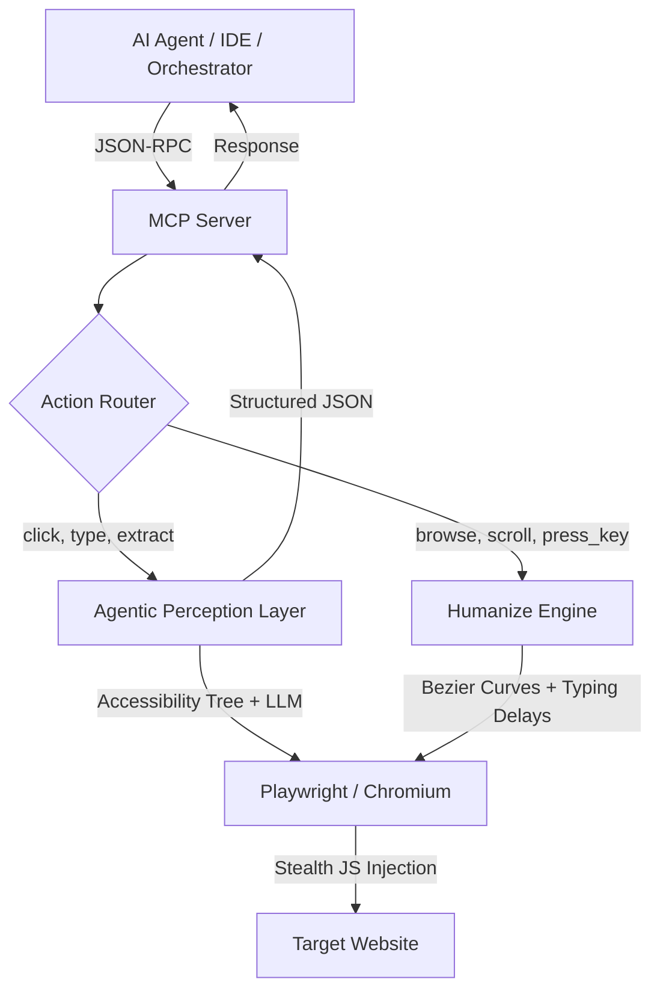

<p align="center">
  <h1 align="center">Go-WebMCP</h1>
  <p align="center">
    <strong>Intelligent Stealth Browser &bull; MCP Server &bull; Built for AI Agents</strong>
  </p>
  <p align="center">
    <a href="#quick-start">Quick Start</a> •
    <a href="#features">Features</a> •
    <a href="#available-tools">Tools</a> •
    <a href="#architecture">Architecture</a> •
    <a href="CONTRIBUTING.md">Contributing</a>
  </p>
</p>

---

Go-WebMCP is a production-ready **Model Context Protocol (MCP)** server built in Go. It acts as an **Intelligent Stealth Browser Proxy** — enabling LLMs, autonomous agents, and AI-powered IDEs to navigate the web, bypass anti-bot systems, and extract structured data at scale.

Built with ❤️ for the AI community.

## Features

| Feature | Description |
|---|---|
| **LLM-Powered Navigation** | Navigate using natural language — `click("Login button")`, `type("Search box", "AI tools")` |
| **Stealth Hardening** | 20+ Playwright-level fingerprint patches: Bézier mouse curves, human typing cadence, WebGL/Canvas noise |
| **Map-Reduce Extraction** | Splits massive SPAs (300K+ chars) into smart chunks, runs parallel LLM extraction, and stitches validated JSON |
| **W3C WebMCP Ready** | Auto-detects native `navigator.modelContext` endpoints to reduce inference costs |
| **Universal LLM Support** | Works with OpenAI, Ollama, Groq, Together, NVIDIA NIM, LM Studio — any OpenAI-compatible API |
| **Docker Ready** | Single-command containerized deployment for headless scraping at scale |

## Setup Guide

### Prerequisites

| Requirement | Version | Check |
|---|---|---|
| **Go** | 1.22+ | `go version` |
| **Git** | any | `git --version` |

> **Don't have Go?** Install from [go.dev/dl](https://go.dev/dl/) — download the installer for your OS, run it, and restart your terminal.

### Step 1: Clone and Build

```bash
git clone https://github.com/yranjan06/GO-WebMcp.git
cd GO-WebMcp
make build
```

You should see:
```
go build -o webmcp cmd/server/*.go
 Built ./webmcp
```

### Step 2: Install Browser Dependencies

Go-WebMCP uses Playwright to control a real Chromium browser. This step downloads the browser binary (~400MB, one-time):

```bash
make install-deps
```

> **This can take 2-5 minutes** depending on your internet speed. It downloads Chromium, Firefox, and WebKit binaries. You only need to do this once.

If this fails with a permission error, try:
```bash
sudo go run github.com/playwright-community/playwright-go/cmd/playwright@latest install --with-deps
```

### Step 3: Get a Free LLM API Key

Go-WebMCP needs an LLM API key for AI-powered features (`click`, `type`, `extract`). Here are free options:

| Provider | Free Tier | Speed | Setup Time |
|---|---|---|---|
| **Groq** | 30 requests/min | Fastest | 30 seconds |
| **Google Gemini** | 15 requests/min | Smartest | 1 minute |
| **OpenRouter** | Varies by model | Good | 1 minute |
| **NVIDIA NIM** | 1000 free credits | Good | 2 minutes |
| **Ollama** (local) | Unlimited | Depends on hardware | 5 minutes |

**Recommended for beginners: [Groq](https://console.groq.com)** — fastest signup, most generous free limits.

<details>
<summary><strong>Groq (Recommended)</strong></summary>

1. Go to [console.groq.com](https://console.groq.com) and sign up
2. Create an API key from the dashboard
3. Configure:
```bash
export AI_API_KEY="gsk_your-groq-key"
export AI_BASE_URL="https://api.groq.com/openai/v1"
export AI_MODEL="llama-3.3-70b-versatile"
```
</details>

<details>
<summary><strong>Google Gemini</strong></summary>

1. Go to [aistudio.google.com](https://aistudio.google.com) and sign in with Google
2. Click "Get API Key" and create a key
3. Configure:
```bash
export AI_API_KEY="your-gemini-key"
export AI_BASE_URL="https://generativelanguage.googleapis.com/v1beta/openai"
export AI_MODEL="gemini-2.0-flash"
```
</details>

<details>
<summary><strong>OpenRouter</strong></summary>

1. Go to [openrouter.ai](https://openrouter.ai) and sign up
2. Create an API key from Settings
3. Configure:
```bash
export AI_API_KEY="sk-or-your-key"
export AI_BASE_URL="https://openrouter.ai/api/v1"
export AI_MODEL="meta-llama/llama-3.3-70b-instruct:free"
```

> **Note:** Free models on OpenRouter have strict rate limits. If you get `429 Too Many Requests` errors, wait a few seconds between actions or upgrade to a paid model.
</details>

<details>
<summary><strong>NVIDIA NIM</strong></summary>

1. Go to [build.nvidia.com](https://build.nvidia.com) and sign up
2. Get an API key from "Get API Key" button
3. Configure:
```bash
export AI_API_KEY="nvapi-your-key"
export AI_BASE_URL="https://integrate.api.nvidia.com/v1"
export AI_MODEL="meta/llama-3.1-8b-instruct"
```
</details>

<details>
<summary><strong>Ollama (100% Local, No Internet)</strong></summary>

1. Download from [ollama.com](https://ollama.com)
2. Pull a model: `ollama pull llama3.2`
3. Configure:
```bash
export AI_API_KEY="ollama"
export AI_BASE_URL="http://localhost:11434/v1"
export AI_MODEL="llama3.2"
```

> Requires ~4GB RAM minimum. No API limits since it runs entirely on your machine.
</details>

### Step 4: Verify It Works

Run a quick smoke test to confirm everything is set up:

```bash
./webmcp --help
```

You should see the Go-WebMCP banner with ASCII art and usage instructions. If AI features are configured correctly, the server log will show:
```
[AI] Using custom endpoint: https://... (model: ...)
```

### Step 5: Connect to Your IDE

**VS Code / Cursor / Windsurf** — Add to `.vscode/mcp.json`:

```json
{
  "servers": {
    "go-webmcp": {
      "type": "stdio",
      "command": "/absolute/path/to/webmcp",
      "env": {
        "AI_API_KEY": "your-key-here",
        "AI_BASE_URL": "https://api.groq.com/openai/v1",
        "AI_MODEL": "llama-3.3-70b-versatile"
      }
    }
  }
}
```

> **Important:** Replace `/absolute/path/to/webmcp` with the actual full path to your `webmcp` binary. Find it with: `pwd` (in the GO-WebMcp directory).

**Claude Desktop** — Add to `claude_desktop_config.json`:

```json
{
  "mcpServers": {
    "go-webmcp": {
      "command": "/absolute/path/to/webmcp",
      "env": {
        "AI_API_KEY": "your-key-here"
      }
    }
  }
}
```

### Docker Setup (Optional)

If you prefer containerized deployment:

```bash
# Build and run with Docker
make docker
docker run -p 8080:8080 \
  -e AI_API_KEY="your-key" \
  -e BROWSER_HEADLESS="true" \
  go-webmcp --port=8080

# Or with Docker Compose
export AI_API_KEY="your-key"
make docker-compose
```

### Troubleshooting

| Problem | Solution |
|---|---|
| `command not found: go` | Install Go from [go.dev/dl](https://go.dev/dl/) and restart terminal |
| `make build` fails | Run `go mod download` first to fetch dependencies |
| `Playwright install` hangs | Check internet connection; it downloads ~400MB of browser binaries |
| `Browser engine failed to initialize` | Run `make install-deps` to install Playwright browsers |
| `AI agent not available` | Set `AI_API_KEY` environment variable (see Step 3) |
| `429 Too Many Requests` | Free API tier rate limit hit. Wait 10s and retry, or switch provider |
| Browser window not showing | Set `BROWSER_HEADLESS=false` (default) or remove the env var |

## Environment Variables

| Variable | Required | Default | Description |
|---|---|---|---|
| `AI_API_KEY` | Yes | — | API key for your LLM provider |
| `AI_BASE_URL` | — | OpenAI | Custom LLM endpoint URL |
| `AI_MODEL` | — | `gpt-4o` | Model for element finding |
| `EXTRACTION_MODEL` | — | same as `AI_MODEL` | Separate model for data extraction |
| `EXTRACTION_API_KEY` | — | same as `AI_API_KEY` | Separate key for extraction model |
| `EXTRACTION_BASE_URL` | — | same as `AI_BASE_URL` | Separate endpoint for extraction |
| `BROWSER_HEADLESS` | — | `false` | Run Chromium in headless mode |
| `BROWSER_USER_DATA_DIR` | — | — | Persist cookies/sessions across restarts |
| `HTTP_PROXY` | — | — | Proxy server (e.g., `http://proxy:8080`) |
| `PROXY_USERNAME` | — | — | Proxy authentication username |
| `PROXY_PASSWORD` | — | — | Proxy authentication password |

## Available Tools

### Navigation
| Tool | Description |
|---|---|
| `browse` | Navigate to a URL with stealth mode |
| `go_back` | Browser back button |
| `go_forward` | Browser forward button |

### Interaction
| Tool | Description |
|---|---|
| `click` | Natural-language driven smart clicking |
| `type` | Humanized typing on a targeted element |
| `press_key` | Simulate keyboard key press (Enter, Tab, etc.) |
| `fill_form` | Batch fill multiple form fields |
| `scroll` | Scroll up or down with human-like behavior |
| `scroll_to_bottom` | Dynamically scroll infinite feeds to completion |

### Data Extraction
| Tool | Description |
|---|---|
| `extract` | Map-Reduce JSON extraction — feed a JSON Schema, get structured data |
| `execute_js` | Run arbitrary JavaScript in the page context |
| `get_accessibility_tree` | Get semantic ARIA snapshot of the page |
| `get_console_logs` | Retrieve browser console output |

### Multi-Tab
| Tool | Description |
|---|---|
| `open_tab` | Open a new browser tab |
| `switch_tab` | Switch to a tab by index |
| `close_tab` | Close a tab by index |
| `list_tabs` | List all open tabs with URLs and titles |

### Utilities
| Tool | Description |
|---|---|
| `wait_for_selector` | Wait for a CSS selector to appear |
| `wait_for_load_state` | Wait for page load / network idle |
| `configure_dialog` | Auto-handle browser alert/confirm dialogs |
| `get_status` | Server health check and last action report |
| `get_network_requests` | Get captured HTTP request log |
| `clear_network_requests` | Clear the request log |

## Architecture



## Python Integration

```python
import subprocess, json, os

env = os.environ.copy()
env["AI_API_KEY"] = "sk-..."

process = subprocess.Popen(
    ['./webmcp'],
    stdin=subprocess.PIPE,
    stdout=subprocess.PIPE,
    text=True,
    env=env
)

# Call any MCP tool via JSON-RPC
msg = {
    "jsonrpc": "2.0",
    "method": "tools/call",
    "id": 1,
    "params": {
        "name": "browse",
        "arguments": {"url": "https://news.ycombinator.com"}
    }
}
process.stdin.write(json.dumps(msg) + '\n')
process.stdin.flush()
```

## Extending Go-WebMCP

### Add a Stealth Script
Drop a `.js` file into `pkg/stealth/js/` → Add a toggle in `StealthConfig` → Done. It auto-embeds via `//go:embed`.

### Add an MCP Tool
Define an arg struct + handler in `cmd/server/tools.go` → It auto-registers on startup.

See [CONTRIBUTING.md](CONTRIBUTING.md) for detailed guides.

## Examples

See the [`examples/`](examples/) directory for real-world automation scripts targeting LinkedIn, Reddit, Twitter, Naukri and more.

## Project Structure

```
go-webmcp/
├── cmd/server/          # MCP server entrypoint
│   ├── main.go          # Bootstrap (flags, banner, transport)
│   ├── config.go        # Version and constants
│   └── tools.go         # All MCP tool handlers
├── pkg/
│   ├── agent/           # LLM-powered perception
│   │   ├── perception.go  # Element finding via accessibility tree
│   │   ├── extract.go     # Map-Reduce structured extraction
│   │   └── cache.go       # Semantic selector cache
│   ├── browser/         # Playwright engine
│   │   ├── engine.go      # Browser lifecycle, tabs, navigation
│   │   ├── humanize.go    # Bézier mouse, typing cadence
│   │   └── retry.go       # Exponential backoff utility
│   ├── stealth/         # Anti-detection layer
│   │   ├── stealth.go     # Config and script injection
│   │   └── js/            # 22 embedded fingerprint patches
│   └── transport/sse/   # HTTP/SSE transport
├── examples/            # E2E automation scripts
├── Dockerfile
├── Makefile
└── go.mod
```

## License

MIT License — see [LICENSE](LICENSE) for details.

---

<p align="center">
  Built with heart for the AI community
</p>
